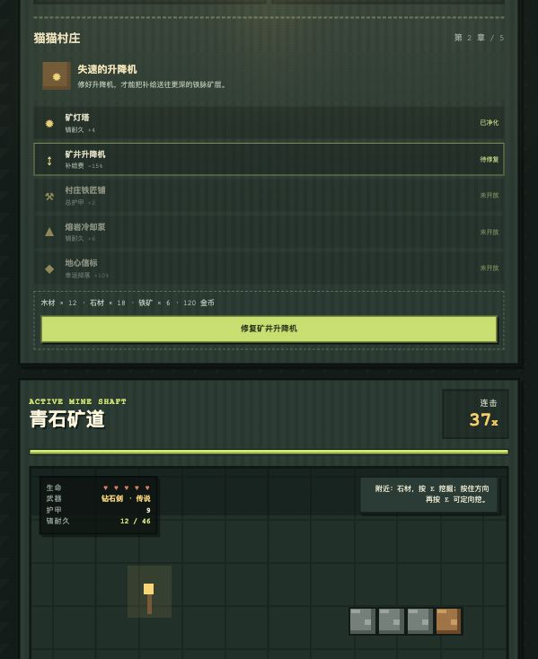

# 小猫挖矿 MC 版

一款使用原生 HTML、CSS 和 JavaScript 编写的像素风矿洞探索游戏。玩家需要操控小猫挖矿、战斗、出售资源、升级装备，并修复猫猫村庄熄灭的地心矿灯。



## 游戏目标

游戏采用章节制成长循环：

```text
探索矿洞 -> 收集资源 -> 修复村庄工程 -> 获得实际增益
-> 召唤区域 Boss -> 击败 Boss -> 解锁下一张地图
```

五章主线包括：

| 章节 | 村庄工程 | 区域 Boss | 解锁内容 |
| --- | --- | --- | --- |
| 熄灭的矿灯 | 矿灯塔 | 腐化史莱姆王 | 青石矿道 |
| 失速的升降机 | 矿井升降机 | 岩穴蜘蛛女王 | 铁脉深井 |
| 失踪的铁匠 | 村庄铁匠铺 | 地底僵尸队长 | 熔金洞穴 |
| 熔岩之下 | 熔岩冷却泵 | 熔岩核心守卫 | 钻石地心 |
| 地心最后的光 | 地心信标 | 黑暗晶体巨像 | 自由深渊模式 |

## 核心规则

- 方向键或 `A/D` 控制小猫移动，按 `E` 挖掘面前或指定方向的方块。
- 背包资源既可以逐个卖出，也可以按 `S` 一次性全部出售。
- 镐子挖掘力和耐久上限分开升级。更换镐子或提升耐久上限不会恢复当前耐久。
- 镐子耗尽后按 `Q` 支付补给费，开启新班次并恢复至当前耐久上限。
- 推荐成长顺序：主线材料 -> 镐力与耐久 -> 剑与护甲 -> 区域 Boss。

## 操作方式

| 按键 | 功能 |
| --- | --- |
| `←/→` 或 `A/D` | 左右移动 |
| `↑`、`W` 或空格 | 跳跃 |
| `E` | 挖掘面前方块 |
| 按住方向键并按 `E` | 定向挖掘 |
| `F` | 挥剑攻击 |
| `S` | 出售背包中的矿物 |
| `Q` | 支付补给费，开启新的矿井班次 |
| `R` | 返回安全入口 |
| `M` | 开关音效 |

## 本地运行

项目不需要安装依赖。克隆后进入目录，启动一个静态文件服务：

```bash
python3 -m http.server 4173 --bind 127.0.0.1
```

然后打开：

```text
http://127.0.0.1:4173/
```

也可以直接用浏览器打开 `index.html`。

## 跨设备继续开发

仓库发布后，可以在任意设备克隆代码：

```bash
git clone https://github.com/Mr-Z11/kitty-mc-miner.git
cd kitty-mc-miner
```

修改完成后提交并推送：

```bash
git add .
git commit -m "Describe your improvement"
git push
```

在 GitHub 仓库页面按下 `.`，还可以直接使用网页版编辑器继续开发。

## GitHub Pages

项目包含 GitHub Pages 自动部署工作流。仓库创建后，在 GitHub 仓库的 `Settings > Pages` 中将发布来源设为 `GitHub Actions`，后续推送到 `main` 分支即可自动更新在线版本。

预期在线地址：

```text
https://mr-z11.github.io/kitty-mc-miner/
```

## 开源许可证

本项目使用 [MIT License](./LICENSE)。
